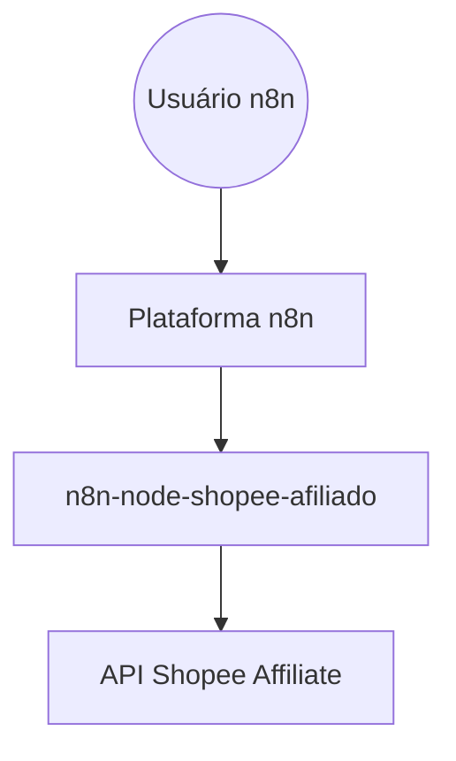
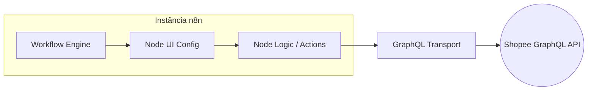

# Overview — n8n-node-shopee-afiliado

Este projeto é um pacote de nodes customizados para a plataforma n8n, focado em automatizar interações com a API de Afiliados da Shopee. Ele permite que usuários do n8n integrem fluxos de marketing, busca de produtos e gestão de links de afiliados de forma nativa.

## Índice
- `stack.md` — tecnologias
- `modules.md` — componentes
- `flows.md` — fluxos principais
- `decisions.md` — decisões de design

---

## Arquitetura (C4 Model)

### Nível 1: Contexto

### Nível 2: Containers

